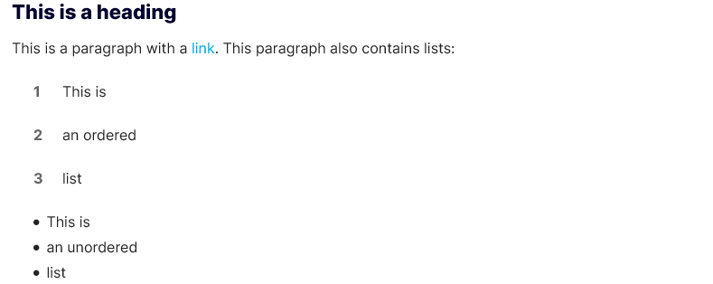
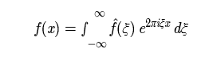
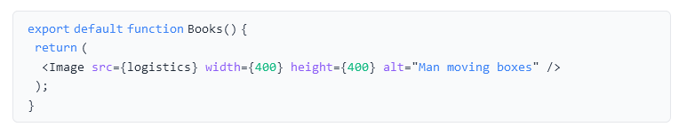
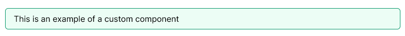
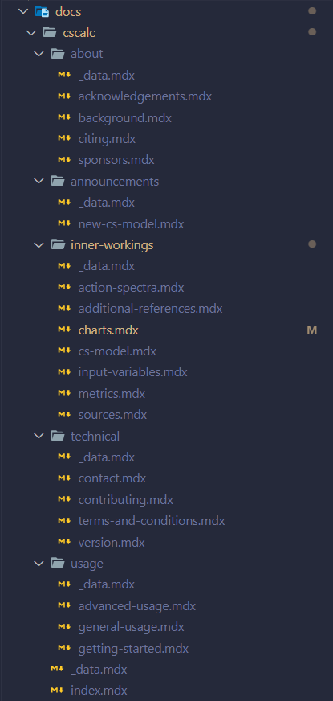
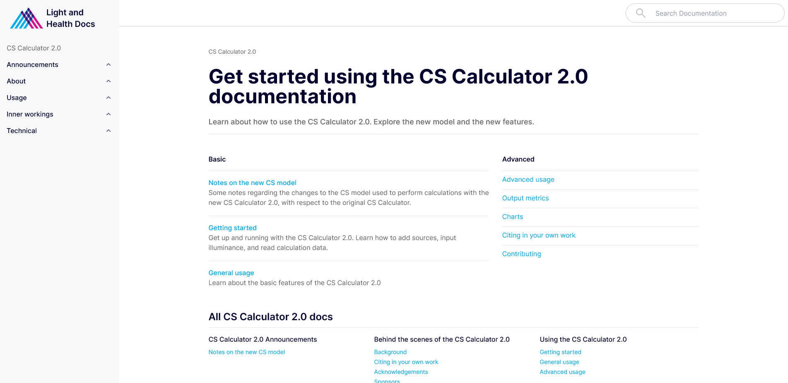
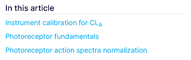
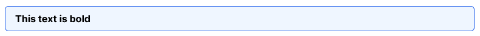
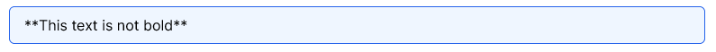

# Authoring

How to create documentation modules for [Light and Health Docs](https://docs.light-health.org)

## Table of contents

- [MDX](#mdx)
  - [Markdown](#markdown)
  - [Markdown extensions](#markdown-extensions)
  - [Custom components](#custom-components)
  - [Frontmatter](#frontmatter)
- [Documentation structure](#documentation-structure)
  - [Directory structure](#directory-structure)
  - [Naming files and directories](#naming-files-and-directories)
  - [\_data.mdx](#--datamdx)
  - [index.mdx](#indexmdx)
  - [documentation .mdx files](#documentation-mdx-files)
- [Static files](#static-files)
- [Misc notes](#misc-notes)
  - [Markdown headings](#markdown-headings)
  - [Markdown inside components](#markdown-inside-components)

## MDX

The [Light and Health Docs](https://docs.light-health.org) are written in [markdown](https://www.markdownguide.org/), or more specifically [MDX](https://mdxjs.com/). More on MDX later.

### Markdown

> Markdown is a lightweight markup language that you can use to add formatting elements to plaintext text documents. Created by John Gruber in 2004, Markdown is now one of the world’s most popular markup languages.

Each of the individual pages in this website is written in markdown. Markdown provides a very simple authoring experience, allowing us to write documentation pages fast, without the need to program any html/css/js.

Here is an example:

```md
## This is a heading

This is a paragraph with a [link](https://www.google.com). This paragraph also contains lists:

1. Item 1
2. Item 2
3. Item 3

- Item
- Item
- Item
```



Markdown supports headings, paragraphs, lists, tables, links, and more.

To learn how to write markdown, visit [markdownguide.org](https://www.markdownguide.org/) or see Adam Pritchard's [Markdown Cheatseat](https://github.com/adam-p/markdown-here/wiki/Markdown-Cheatsheet#emphasis).

### Markdown extensions

[Light and Health Docs](https://docs.light-health.org) also supports a few markdown extensions empowered via [rehype](https://github.com/rehypejs/rehype) and [remark](https://github.com/gnab/remark).

#### KaTeX

[KaTeX](https://katex.org/) is a math typesetting library, which allows us to write [LaTeX](https://www.latex-project.org/) flavored text directly into our markdown.

```md
$$
f(x) = \int_{-\infty}^\infty\hat f(\xi)\,e^{2 \pi i \xi x}\,d\xi
$$
```



View KaTeX documentation [here](https://katex.org/docs/api.html), including [supported functions](https://katex.org/docs/supported.html)

#### Prism

[Prism](https://prismjs.com/) is a syntax highlighter which will highlight our markdown code blocks for us.

````md
```jsx
export default function Books() {
  return (
    <Image src={logistics} width={400} height={400} alt="Man moving boxes" />
  );
}
```
````



View Prism supported languages [here](https://prismjs.com/#supported-languages).

### Custom components

[MDX](https://mdxjs.com/) (.mdx) is an extension of markdown which allows us to author custom react components into our markdown. This essentially allows for limitless customizability in our markdown.

```jsx
<AlertBox color="green">This is an example of a custom component</AlertBox>
```



For a full list of available custom markdown components, see [COMPONENTS.md](./COMPONENTS.md).

To request a new custom markdown component, or to create your own, see [CONTRIBUTING.ms](./CONTRIBUTING.md)

### Frontmatter

Frontmatter is the bit at the top of markdown file which provides us with some metadata. Frontmatter is written in [YAML](https://yaml.org/) flavored text. See [here](https://docs.ansible.com/ansible/latest/reference_appendices/YAMLSyntax.html) for YAML documentation.

```md
---
title: "Charts"
desc: "A deep dive into the charts panel of the CS Calculator 2.0"
---
```

The website uses this metadata to organize files, provide search, title pages, etc.

## Documentation structure

Now that you know a little more about writing markdown files, you need to learn how to organize your files so that they can imported correctly into the website file structure.

### Directory structure

Following is the specific outlines for how to structure a new documentation modules, though its probably helpful and most efficient to copy an already existing module and replace information as you go.

Feel free to refer to the cscalc directory structure as you go.



All documentation modules (ex. cscalc) are stored in the [docs](./docs) directory. Each sub-directory of the docs directory shall contain a new module.

The module root directory should contain a sub-directory for each of the desired navigation menu headings (ex. about, announcements, etc.), as well as a \_data.mdx file and an index.mdx file; more on those in the following sections.

Each of the module menu sub-directories shall contain .mdx files corresponding to each of the desired documentation pages that exist under that menu heading (ex. acknowledgements.mdx, background.mdx, etc.), as well as a \_data.mdx file.

### Naming files and directories

The module-level directories name (ex. cscalc) is unimportant, as long as its unique. It won't show up anywhere in the documentation except in the URL.

Menu heading sub-directories, and their contained documentation .mdx files should all be named in accordance with how they are represented on the site, only lowercase and with any spaces replaced with "-". (ex. General usage becomes general-usage.mdx, Inner workings directory becomes inner-workings).

It's important that the directory and file names match exactly (with the mentioned adjustments) or else the website won't be able to locate them.

### \_data.mdx

Every module root directory and its containing menu heading sub-directories contains a \_data.mdx file containing Frontmatter for storing extra metadata.

#### Module level

The module level directory \_data.mdx file contains information about that module. Take a look at the CS Caclulator module directories \_data.mdx file.

```md
---
module_title: "CS Calculator 2.0"
module_img: "/img/docs/cscalc/card.png"
module_desc: "Calculate the circadian effectiveness of a light source."
programs:
  - "Human"
structure:
  - "Announcements":
      - "New CS model"
  - "About":
      - "Background"
      - "Citing"
      - "Acknowledgements"
      - "Sponsors"
  - "Usage":
      - "Getting started"
      - "General usage"
      - "Advanced usage"
  - "Inner workings":
      - "CS model"
      - "Action spectra"
      - "Sources"
      - "Input variables"
      - "Metrics"
      - "Charts"
      - "Additional references"
  - "Technical":
      - "Contributing"
      - "Version"
      - "Contact"
      - "Terms and conditions"
---
```

#### Attributes

- module_title
- module_img - relative to the /public directory
- module-description
- programs
  - "Plant"
  - "Energy"
  - "Human"
  - and/or "Transportation"
- structure - the structure of that module, with correct capitilization and in the correct order you desire.

#### Heading level

Heading level \_data.mdx contain only title and desc attributes, which help to describe that heading.

Take a look at the cscalc/technical \_data.mdx file.

```md
---
title: "CS Calculator 2.0 technical resources"
desc: "Technical resources and support for the CS Calculator 2.0"
---
```

#### Attributes

- title
- desc

Note that the title attribute does not need to match the heading level's directory name.

### index.mdx

index.mdx is a single file located in the module's root directory which contains the normal "title" and "desc" attributes along with layout information attributes. This file also support normal markdown text following the Frontmatter.

Take a look at the cscalc index.mdx file.

```md
---
title: "Get started using the CS Calculator 2.0 documentation"
desc: "Learn about how to use the CS Calculator 2.0. Explore the new model and the new features."
layout: "twolist"
list1:
  title: "Basic"
  children:
    - "/announcements/new-cs-model"
    - "/usage/getting-started"
    - "/usage/general-usage"
list2:
  title: "Advanced"
  children:
    - "/usage/advanced-usage"
    - "/inner-workings/metrics"
    - "/inner-workings/charts"
    - "/about/citing"
    - "/technical/contributing"
---
```

This file corresponds to this page:



#### layouts

Currently there is only one layout option available `"twolist"` which requires you to specify the names and children (in the form of relative URL's) of two lists, the first one includes desc information and the second doesn't.

##### Attributes

- title
- desc
- layout - "twolist"
- list1
  - title
  - children
    - child1
    - child2
    - childn
- list2
  - title
  - children
    - child1
    - child2
    - childn

### documentation .mdx files

Documentation .mdx files shall contain Fontmatter with "title" and "desc" attributes, followed by any markdown text.

Note that the title attribute does not need to match the documentations file name.

## Static files

Any static files such as images, videos, pdf's, and other documents that you want to reference in your documentation must be stored in the [/public](./public) directory. This is the only directory which is guranteed to be served by the site.

I recommend matching the [docs](./docs) directory structure in the [public](./public) directory, i.e. if I was serving an image to be used on the docs/cscalc/about/background page, I would store the image in /public/img/cscalc/about/background directory.

## Misc notes

### Markdown headings

.mdx files should not contain any H1 headings (i.e. # Examply heading), as it is standard to have only 1 H1 element per page, which is taken care of by the website automatically.

Only H2 headings (i.e. ## Example heading) will be captured in the "In this article" table of contents.



### Markdown inside components

Custom MDX components _DO NOT_ support markdown syntax. This is due to that with .mdx, the markdown text is interpreted first, and then the custom components are interpreted, meaning there is no easy way to go back and reinterpret half already interpreted markdown.

This means if you want to do something like bold text inside an AlertBox, you must use the html alternative, such as:

```jsx
<AlertBox>
  <b>This text is bold</b>
</AlertBox>
```



whereas this does not work:

```jsx
<AlertBox>**This text is not bold**</AlertBox>
```


