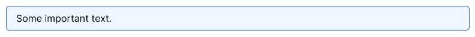
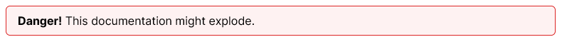
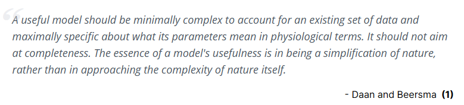
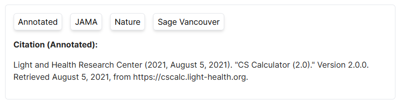
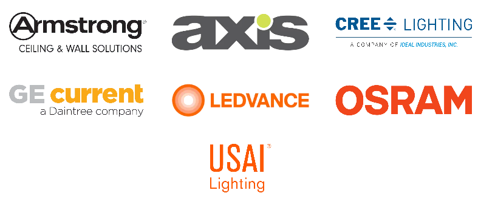
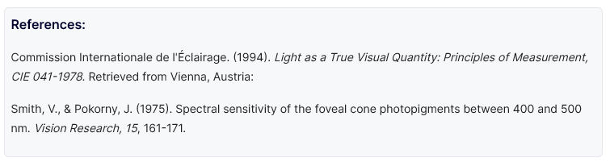

# Custom markdown components

These are a list of custom react components available to you when writing .mdx documentation files.

### Request components

If you'd like to request a custom markdown component, or create one yourself, see [CONTRIBUTING.md](./CONTRIBUTING.md).

### Table of Contents

* [AlertBox](#alertbox)
* [BlockQuote](#blockquote)
* [CSCalcCitationGenerator](#cscalccitationgenerator)
* [DocLink](#doclink)
* [Icon](#icon)
* [ImageGallery](#imagegallery)
* [Img](#img)
* [References](#references)

## AlertBox

Make some text standout.

```jsx
<AlertBox>Some important text.</AlertBox>
```



```jsx
<AlertBox color="red"><b>Danger!</b> This documentation might explode.</AlertBox>
```


### props

* color (optional)
  * "blue" (default)
  * "red"
  * "yellow"
  * "green"
  * "indigo"
  * "purple"
  * "pink"

## BlockQuote

Make a quote stand

```jsx
<BlockQuote by="Daan and Beersma" ref_num={1}>A useful model should be minimally complex to account for an existing set of data and maximally specific about what its parameters mean in physiological terms. It should not aim at completeness. The essence of a model's usefulness is in being a simplification of nature, rather than in approaching the complexity of nature itself.</BlockQuote>
```



### props

* by (required) - the author of the quote
* ref_num (optional) - reference a <Reference /> number

## CSCalcCitationGenerator

A one off component to aid in creating up-tp-date citations for the cs calculator. Pulls latest commit date and published date from GitHub

```jsx
<CSCalcCitationGenerator />
```



### props

* by (required) - the author of the quote
* ref_num (optional) - reference a <Reference /> number

## DocLink

For linking internally to other docs pages. Utilizes next.js `<Link />` to not reload page.


```jsx
<DocLink href="/path/to/page">Page link</DocLink>
```


### props

* href (required) - the relative URL to a docs page (ex. cscalc/inner-workings/charts)

## Icon

Add [Heroicons](https://heroicons.com/) to your docs. See [CONTRIBUTING.md](./CONTRIBUTING.md) to request additional icons.

```jsx
<Icon icon="mail" />
```


```jsx
<Icon icon="mail" size="xl"/>
```


### props

* icon (required) - the name of the icon. See [Heroicons](https://heroicons.com/) for list of icons and names
  * "mail"
* inline (optional)
  * {true}
  * {false} (default)
* size (optional)
  * "xs"
  * "sm" (default)
  * "md"
  * "lg"
  * "xl"

## ImageGallery

Align images in columns

```jsx
<ImageGallery height="sm" cols={3}>
  <ImageGalleryImage
    src="/img/docs/cscalc/about/sponsors/armstrong.png"
    alt="Armstrong Ceiling & Wall Solutions logo"
    link="https://www.armstrongceilings.com/commercial/en/"
  />
  <ImageGalleryImage
    src="/img/docs/cscalc/about/sponsors/axis.png"
    alt="Axis Lighting logo"
    link="https://www.axislighting.com/"
  />
  <ImageGalleryImage
    src="/img/docs/cscalc/about/sponsors/cree.png"
    alt="Cree Lighting a Company of Ideal Industries, Inc logo"
    link="https://www.creelighting.com/"
  />
  <ImageGalleryImage
    src="/img/docs/cscalc/about/sponsors/ge.png"
    alt="GE current a Daintree company logo"
    link="https://www.gecurrent.com/"
  />
  <ImageGalleryImage
    src="/img/docs/cscalc/about/sponsors/ledvance.png"
    alt="Ledvance logo"
    link="https://www.ledvance.com/"
  />
  <ImageGalleryImage
    src="/img/docs/cscalc/about/sponsors/osram.png"
    alt="Osram logo"
    link="https://www.osram.com/cb/"
  />
  <ImageGalleryImage
    src="/img/docs/cscalc/about/sponsors/usai.png"
    alt="USAI Lighting logo"
    link="https://www.usailighting.com/"
  />
</ImageGallery>
```



### props

#### `<ImageGallery/>`

* height (optional) - the height of each row
  * "xxs"
  * "xs"
  * "sm"
  * "md" (default)
  * "lg"
  * "xl"
  * "xxl"
* cols (optional) - the number of cols
  * {2}
  * {3}
  * {4}
  * {5}
  * {6}
  * {12}


#### `<ImageGalleryImage/>`

* src (required) - the relative path to the image, from the [public](./public) directory
* alt (required) - alt text to describe the image. [img alt info](https://www.w3schools.com/tags/att_img_alt.asp)
* link (optional) - URL to wrap image in.
* linkInternal (optional) - whether or not the URL points to an internal doc page.
  * {true}
  * {false} (default)

## Img

For adding images to your docs. Utilizes next.js <Image/> to optimize images.

```jsx

```


#### props

* src (required) - the relative path to the image, from the [public](./public) directory
* alt (required) - alt text to describe the image. [img alt info](https://www.w3schools.com/tags/att_img_alt.asp)
* width (required) - the width of the image
* height (required) - the height of the image

## References

A wrapper for styling references in your docs pages.

```jsx
<References>
  <Reference>
    Commission Internationale de l'Éclairage. (1994).{" "}
    <i>
      Light as a True Visual Quantity: Principles of Measurement, CIE 041-1978
    </i>
    . Retrieved from Vienna, Austria:{" "}
  </Reference>
  <Reference>
    Smith, V., & Pokorny, J. (1975). Spectral sensitivity of the foveal cone
    photopigments between 400 and 500 nm. <i>Vision Research, 15</i>, 161-171.
  </Reference>
</References>
```



#### references props

none
#### reference props

* num (optional) - number the reference.
