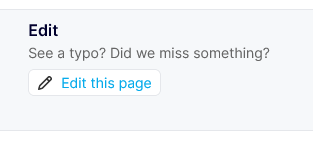

# Contributing

## Editing a documentation file

If you'd like to edit content on any of the documentation pages, click the **Edit this page** button at the bottom of any page. Make any changes and submit a pull request.

## Report a bug

If you'd like to report a bug, please [create an issue](https://github.com/Light-and-Health-Research-Center/docs/issues/new?assignees=&labels=&template=bug_report.md&title=%5BBUG%5D)

## Feature request

If you'd like to request a feature, please [create an issue](https://github.com/Light-and-Health-Research-Center/docs/issues/new?assignees=&labels=&template=feature_request.md&title=)

## Custom markdown components for .mdx

If you'd like to contribute a custom markdown component avialable when writing .mdx documentation files, please clone the repository and submit a pull request. Custom markdown components are stored in the [/components/markdown](/components/markdown) directory, and exported in the [/components/markdown/MDXComponents.js](/components/markdown/MDXComponents.js) file.

If you'd like to suggest the creation of a new component, please [create an issue](https://github.com/Light-and-Health-Research-Center/docs/issues/new?assignees=&labels=&template=markdown-component-request.md&title=%5BComponent+Request%5D).
